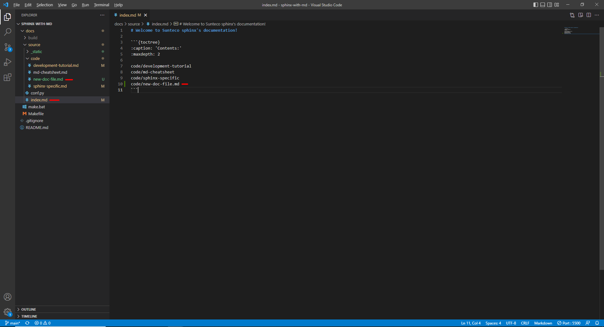
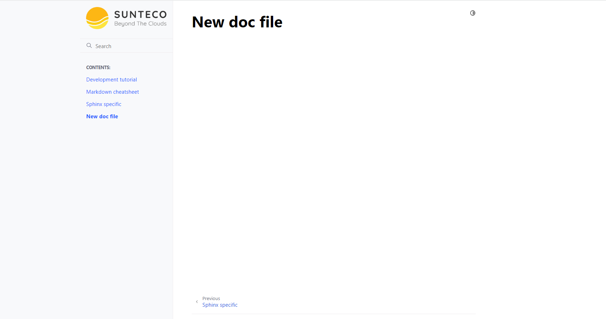

# Development tutorial

## Develop new document page flow

1. Clone project
```
git clone http://github.com/xxx
```

2. Add new document file <br />
```
Create new document file in `docs/source/code/<menu-name>/page/<file-name>` folder
```

3. Add document file to menu <br />
```
Add relative path to document file in `toctree` directive of  `menu-1.md` file
```

<!-- 

 -->

```{figure} ../_static/image/project-structure.png
:scale: 50 %
:alt: project structure

Project structure

```

```{figure} ../_static/image/result.png
:scale: 50 %
:alt: Output result

Output result

```

4. Modify content of document

5. Request merge
* Commit 
* Push 
* Create merge request

---

## Build project from local

### Local installation

1. Install sphinx
```
apt-get install python3-sphinx
```

2. Build project
```
cd path/to/docs/folder
make html
```

```{note}
Install required pip packages if needed
```

3. Run project
```
Run docs/build/html/index.html
```

---

### Using docker

1. Create `Dockerfile`
```
FROM sphinxdoc/sphinx

WORKDIR /docs
RUN pip install myst_parser furo
```

2. Build image
```
docker build -t mysphinx .
```

3. Build project
```
docker run --rm -v /path/to/docs/folder:/docs mysphinx make html
```

4. Run project
```
Run docs/build/html/index.html
```
